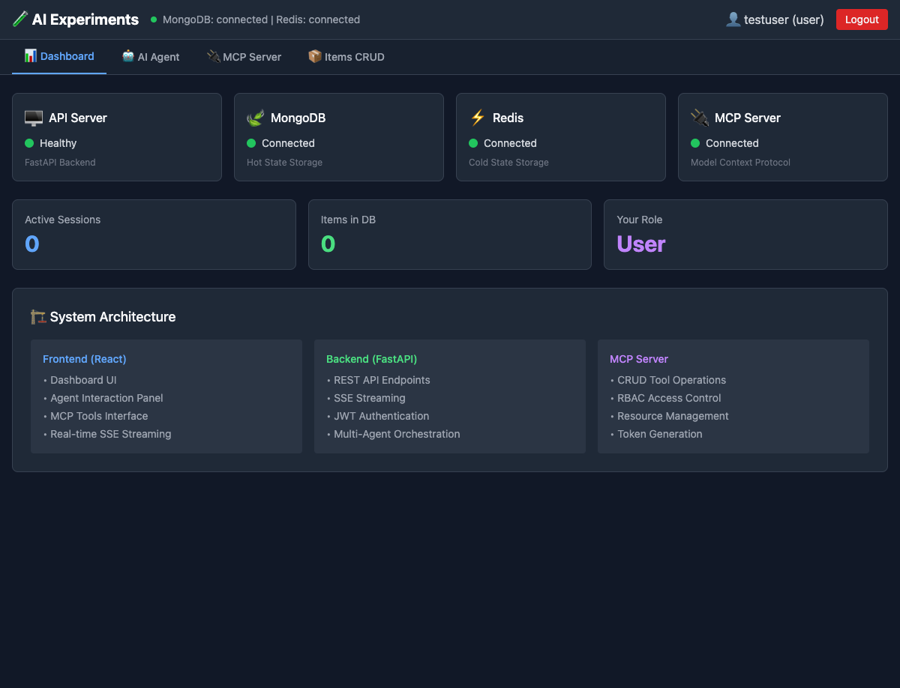
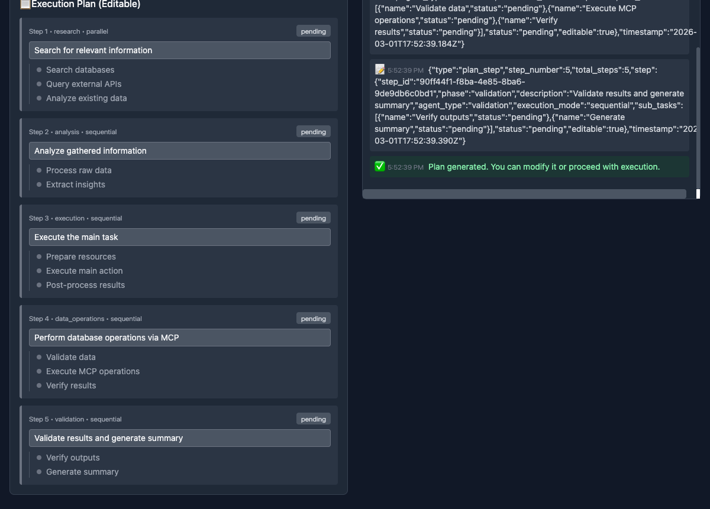
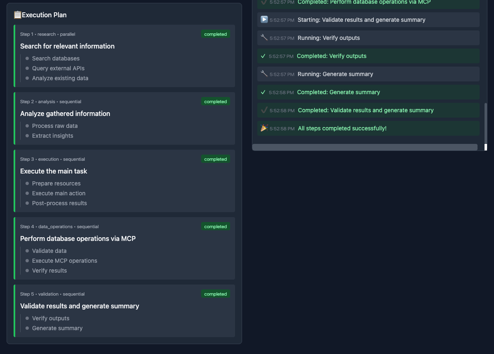
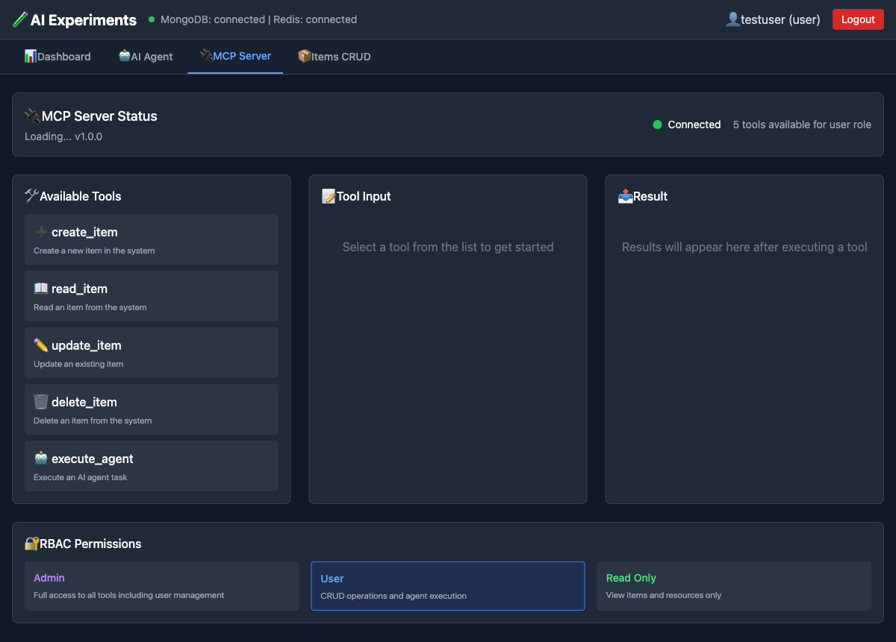

# AI-Experiments

A containerized Python application demonstrating MCP Server, LangGraph multi-agent system with plan mode, SSE streaming, and JWT-based RBAC authentication. Powered by **Google Vertex AI with Gemini 2.5**.



## Features

- **MCP Server**: Model Context Protocol server with RBAC-protected tools
- **Multi-Agent System**: AI agents with parallel/sequential execution modes
- **Plan Mode**: AI-powered plan generation with user editing capability
- **Real AI Integration**: Vertex AI Gemini 2.5 for planning and task execution
- **SSE Streaming**: Real-time Server-Sent Events for plan generation/execution
- **React Frontend**: Modern UI for testing all features
- **Hot State Checkpoints**: MongoDB storage for active agent sessions
- **Cold State Checkpoints**: Redis storage for archived/inactive sessions
- **CRUD Operations**: Full create, read, update, delete operations for items
- **JWT Authentication**: Secure token-based authentication
- **RBAC Authorization**: Role-based access control with permissions
- **Structured Logging**: Comprehensive request/response/AI logging

## Screenshots

| AI Agent Plan | Plan Execution | MCP Server |
|--------------|----------------|------------|
|  |  |  |

## Architecture

```
┌─────────────────────────────────────────────────────────────┐
│                   React Frontend (Port 3000)                 │
├─────────────────────────────────────────────────────────────┤
│  Dashboard  │  AI Agent  │  MCP Server  │  Items CRUD       │
└─────────────────────────────────────────────────────────────┘
                              │
                              ▼
┌─────────────────────────────────────────────────────────────┐
│                 Backend API Server (Port 8000)               │
├─────────────────────────────────────────────────────────────┤
│  Auth API  │  Items API  │  Streaming API  │  Reports API   │
├─────────────────────────────────────────────────────────────┤
│                  Authorization Layer (RBAC)                  │
├─────────────────────────────────────────────────────────────┤
│    Multi-Agent Orchestrator    │       MCP Client           │
│  (Parallel/Sequential Modes)   │  (JSON-RPC over HTTP)      │
├─────────────────────────────────────────────────────────────┤
│              Google Vertex AI (Gemini 2.5 Pro)               │
├─────────────────────────────────────────────────────────────┤
│    MongoDB (Hot State)    │    Redis (Cold State)           │
└─────────────────────────────────────────────────────────────┘
                              ▲
                              │ HTTP with Bearer Token
                              ▼
┌─────────────────────────────────────────────────────────────┐
│              MCP Server (Port 8001) - Separate Container     │
├─────────────────────────────────────────────────────────────┤
│  Transport Layer: GET /sse, POST /message                   │
│  Data Layer: JSON-RPC 2.0 (tools/list, tools/call)         │
├─────────────────────────────────────────────────────────────┤
│  Tools: create_item, read_item, update_item, delete_item,  │
│         list_items, search_items, bulk_create, bulk_delete, │
│         get_statistics, generate_report, get_user_profile   │
└─────────────────────────────────────────────────────────────┘
```

For detailed architecture documentation, see [ARCHITECTURE.md](ARCHITECTURE.md).

## Quick Start (Local Testing)

### Prerequisites

1. **Docker** and **Docker Compose** installed
2. **Node.js** (v18+) for the frontend
3. **Google Cloud Project** with Vertex AI API enabled
4. **Service Account JSON** with Vertex AI permissions

### Step 1: Clone and Configure

```bash
# Clone the repository
git clone https://github.com/codebyvineet/AI-Experiments.git
cd AI-Experiments

# Create .env file from example
cp .env.example .env

# Generate a JWT secret key and add to .env
python3 -c 'import secrets; print(secrets.token_urlsafe(32))'
# Copy the output and update JWT_SECRET_KEY in .env
```

### Step 2: Set Up Google Cloud Credentials

1. Create a service account in [Google Cloud Console](https://console.cloud.google.com/iam-admin/serviceaccounts)
2. Grant it these roles:
   - `Vertex AI User` (roles/aiplatform.user)
3. Download the JSON key file
4. Place it in the credentials directory:

```bash
mkdir -p credentials
mv ~/Downloads/your-service-account.json credentials/service-account.json
```

5. Update `.env` with your project ID:
```bash
# Edit .env and set:
GOOGLE_CLOUD_PROJECT=your-actual-project-id
```

### Step 3: Start Backend Services

```bash
# Start all backend services (FastAPI, MCP Server, MongoDB, Redis)
docker-compose up -d

# Verify all services are running
docker-compose ps
# Should show: app, mcp-server, mongodb, redis all running

# Check backend health
curl http://localhost:8000/health
# Expected: {"status":"healthy","mongodb":"connected","redis":"connected"}

# Check MCP server health  
curl http://localhost:8001/health
# Expected: {"status":"healthy","server":"AI-Experiments MCP Server"...}

# Check logs to verify AI is initialized
docker-compose logs app | grep -E "(✅|🤖)"
# Should see: "✅ AI service initialized"
```

### Step 4: Start Frontend

```bash
# Install frontend dependencies
cd frontend
npm install

# Start development server
npm run dev

# Frontend will be available at http://localhost:3000
```

### Step 5: Test the Application

1. Open **http://localhost:3000** in your browser
2. Click "Don't have an account? Register"
3. Create a new user (e.g., username: `demo`, password: `demo123456`)
4. You're now logged in and can test all features!

---

## Complete Testing Guide

### Test 1: Dashboard
- After login, you'll see the Dashboard tab
- Verify all services show "Connected" status

### Test 2: Items CRUD
1. Click **"Items CRUD"** tab
2. Click **"➕ New Item"**
3. Fill in:
   - Name: `My First Item`
   - Description: `Testing CRUD operations`
   - Data: `{"key": "value"}`
4. Click **"✅ Create"**
5. Item appears in the list
6. Try **Edit** and **Delete** buttons

### Test 3: MCP Server (Model Context Protocol)
1. Click **"MCP Server"** tab
2. You'll see 5 available tools (based on your role permissions):
   - `create_item`, `read_item`, `update_item`, `delete_item`, `execute_agent`
3. Select **"create_item"** tool
4. Enter parameters:
   - name: `MCP Created Item`
   - description: `Created via MCP tool`
5. Click **"▶️ Execute Tool"**
6. See the result in the output panel

### Test 4: AI Agent with Plan Mode (Main Feature!)
1. Click **"AI Agent"** tab
2. Enter a goal in the input box, for example:
   ```
   Create a new item called "AI Report" with description "Generated by AI agent", then list all items to verify it was created
   ```
3. Click **"🚀 Create Plan"**
4. Watch the **Event Stream** panel - you'll see:
   - SSE events arriving in real-time
   - AI analyzing your goal
   - Plan steps being generated (with actual MCP tool references!)
5. Review the generated plan in the **Execution Plan** section
   - Each step shows what tool/API will be used
   - You can edit step descriptions if needed
6. Click **"▶️ Execute Plan"**
7. Watch the execution:
   - Parallel tasks run simultaneously
   - Sequential tasks run one after another
   - Real AI executes each task
8. See the summary when complete

### Test 5: Different User Roles (RBAC)
```bash
# Create a read-only user via CLI
curl -X POST http://localhost:8000/auth/register \
  -H "Content-Type: application/json" \
  -d '{"username": "readonly", "password": "readonly123", "email": "ro@test.com", "role": "read_only"}'
```

Log in as `readonly` user in the UI:
- Items CRUD: Can only view, create/edit/delete buttons disabled
- MCP Server: Only read tools available (2 instead of 5)

---

## CLI Testing Commands

```bash
# Set up authentication
TOKEN=$(curl -s -X POST http://localhost:8000/auth/login \
  -H "Content-Type: application/json" \
  -d '{"username": "demo", "password": "demo123456"}' | jq -r '.access_token')

# Create an item
curl -X POST http://localhost:8000/items/ \
  -H "Content-Type: application/json" \
  -H "Authorization: Bearer $TOKEN" \
  -d '{"name": "CLI Item", "description": "Created via CLI"}'

# List items
curl http://localhost:8000/items/ -H "Authorization: Bearer $TOKEN"

# Get MCP tools
curl http://localhost:8000/stream/mcp/tools -H "Authorization: Bearer $TOKEN"

# Create AI session and generate plan
SESSION=$(curl -s -X POST http://localhost:8000/stream/sessions \
  -H "Content-Type: application/json" \
  -H "Authorization: Bearer $TOKEN" \
  -d '{"goal": "Create item and verify"}' | jq -r '.session_id')

# Stream plan generation (SSE)
curl -N "http://localhost:8000/stream/sessions/$SESSION/plan" \
  -H "Authorization: Bearer $TOKEN"

# Stream plan execution (SSE)
curl -N "http://localhost:8000/stream/sessions/$SESSION/execute" \
  -H "Authorization: Bearer $TOKEN"
```

---

## Viewing Logs

```bash
# Watch backend logs in real-time
docker-compose logs -f app

# Key log indicators:
# 📥 - Incoming request
# 📤 - Outgoing response
# 🤖 - AI request/response
# 📍 - Plan step generated
# ⚡ - Parallel execution
# ✅ - Success
# ❌ - Error
```

Example log output:
```
[INFO] main req:abc12345 │ 📥 POST /stream/sessions
[INFO] multi_agent sess:xyz789 │ 🤖 Invoking AI planning agent...
[INFO] ai_service sess:xyz789 │ 🤖 AI Request to gemini-2.5-pro
[INFO] ai_service sess:xyz789 │ ✅ AI Response received (2340ms)
[INFO] ai_service sess:xyz789 │ 📍 Generated step 1: Create item using create_item MCP tool
```

---

## Stopping Services

```bash
# Stop all services
docker-compose down

# Stop and remove all data (fresh start)
docker-compose down -v

# Stop frontend
# Press Ctrl+C in the terminal running npm run dev
```

## API Endpoints

### Authentication (`/auth`)
- `POST /auth/register` - Register a new user
- `POST /auth/login` - Login and get access token
- `GET /auth/me` - Get current user info
- `POST /auth/token/generate` - Generate internal token for MCP
- `POST /auth/token/validate` - Validate a token
- `GET /auth/roles` - List all roles and permissions

### Items CRUD (`/items`)
- `POST /items/` - Create an item
- `GET /items/` - List all items
- `GET /items/{item_id}` - Get an item
- `PUT /items/{item_id}` - Update an item
- `DELETE /items/{item_id}` - Delete an item

### Streaming/Agent (`/stream`)
- `POST /stream/sessions` - Create a multi-agent session
- `GET /stream/sessions/{id}/plan` - **SSE** Stream plan generation
- `GET /stream/sessions/{id}/execute` - **SSE** Stream plan execution
- `PUT /stream/sessions/{id}/plan` - Update plan (user edits)
- `GET /stream/sessions/{id}` - Get session state
- `GET /stream/mcp/tools` - List available MCP tools
- `POST /stream/mcp/call/{tool}` - Call an MCP tool

### MCP Server (`/mcp`)
- `GET /mcp/tools` - List available tools
- `GET /mcp/resources` - List available resources
- `POST /mcp/tools/call` - Call a tool (legacy)
- `GET /mcp/capabilities` - Get server capabilities

See full API documentation at **http://localhost:8000/docs**

## User Roles & Permissions

| Role | Permissions | MCP Tools Available |
|------|-------------|---------------------|
| `admin` | Full access to all features | All 6 tools |
| `user` | CRUD items, execute agent, MCP read/write | 5 tools (no manage_users) |
| `read_only` | Read items, MCP read only | 2 tools (read_item, list items) |

## MCP Tools

The MCP Server (port 8001) provides the following tools. The AI agent communicates with MCP via JSON-RPC:

| Tool | Description | Parameters |
|------|-------------|------------|
| `create_item` | Create a new item | name (required), description, data |
| `read_item` | Read an item by ID | item_id (required) |
| `update_item` | Update an existing item | item_id (required), name, description, data |
| `delete_item` | Delete an item | item_id (required) |
| `list_items` | List items with pagination | skip, limit |
| `search_items` | Search items by text | query (required), field, limit, offset |
| `bulk_create` | Create multiple items | items (array) |
| `bulk_delete` | Delete multiple items | item_ids (array) |
| `get_statistics` | Get database statistics | none |
| `generate_report` | Generate a report | report_type, filters |
| `get_user_profile` | Get current user profile | none |
| `update_user_profile` | Update user profile | display_name, email, preferences |

## Checkpoint Storage

### Hot State (MongoDB)
- Active agent sessions
- User data & Items data
- Real-time checkpoints

### Cold State (Redis)
- Archived sessions
- Token blacklist
- Session cache with TTL

## Troubleshooting

### AI Service Not Initialized
```bash
# Check logs for AI initialization
docker-compose logs app | grep -E "(AI service|Vertex)"

# If you see "AI service initialization failed":
# 1. Verify credentials file exists
ls -la credentials/service-account.json

# 2. Verify GOOGLE_CLOUD_PROJECT is set in .env
grep GOOGLE_CLOUD_PROJECT .env

# 3. Verify Vertex AI API is enabled in your GCP project
```

### Frontend Can't Connect to Backend
```bash
# Ensure backend is running
curl http://localhost:8000/health

# Check for CORS issues in browser console
# The backend allows all origins by default
```

### Plan Generation Returns Generic Steps
The AI needs to know about your tools. If plans don't reference specific MCP tools like `create_item`:
- Check that the AI service initialized successfully
- The AI prompt includes all tool definitions automatically

### Docker Build Issues
```bash
# Rebuild from scratch
docker-compose build --no-cache app
docker-compose up -d
```

## Environment Variables

| Variable | Description | Default |
|----------|-------------|---------|
| `JWT_SECRET_KEY` | JWT signing secret (min 32 chars) | **Required** |
| `GOOGLE_CLOUD_PROJECT` | Google Cloud project ID | **Required** |
| `GOOGLE_APPLICATION_CREDENTIALS` | Path to service account JSON | `/app/credentials/service-account.json` |
| `GOOGLE_CLOUD_LOCATION` | Vertex AI region | `us-central1` |
| `VERTEXAI_MODEL` | Model name | `gemini-2.5-pro` |
| `MONGODB_URL` | MongoDB connection URL | `mongodb://mongodb:27017` |
| `MONGODB_DATABASE` | Database name | `mcp_demo` |
| `REDIS_URL` | Redis connection URL | `redis://redis:6379` |

## Documentation

- [ARCHITECTURE.md](ARCHITECTURE.md) - Detailed system architecture with diagrams
- [TESTING.md](TESTING.md) - Comprehensive end-to-end testing guide
- [API Docs](http://localhost:8000/docs) - Interactive Swagger UI (when running)

## License

MIT License